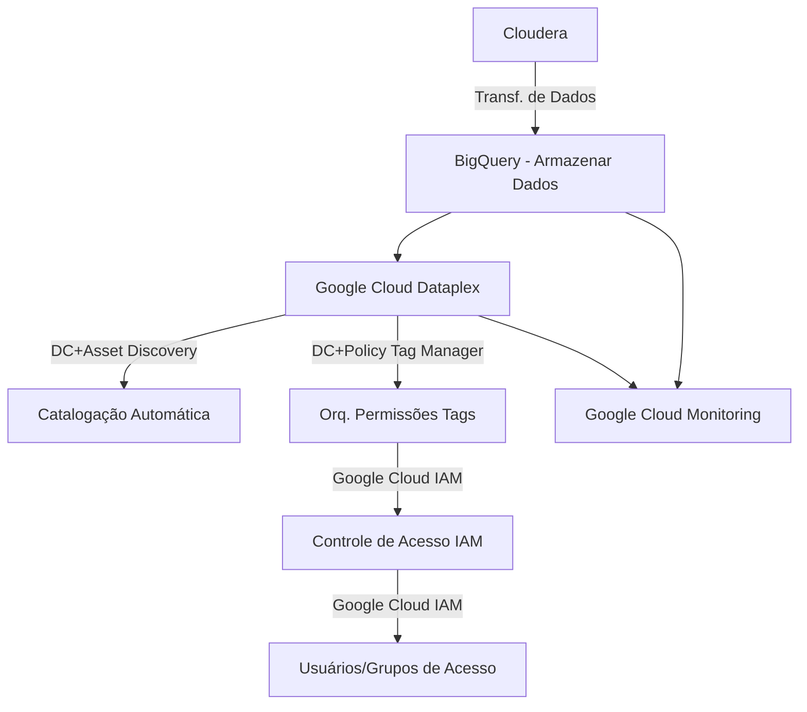

# Relatório de Estudos
**Nome do Estagiário:** Gabriel Alvim  
**Data:** 26/09/2024
#
# Gestão no Google Cloud Platform
A governança de dados no Google Cloud Platform (GCP) é essencial para a organização eficaz das informações, sendo estruturada em torno de pastas e projetos. A arquitetura do GCP permite que as organizações definam hierarquias claras, onde as pastas funcionam como contêineres para projetos, facilitando a gestão e a aplicação de políticas de governança. Essa estrutura promove um controle centralizado sobre acesso e permissões, assegurando que as práticas de segurança e conformidade sejam seguidas. Assim, a relação entre governança de dados e a arquitetura do GCP não apenas otimiza o gerenciamento de recursos, mas também fortalece a integridade e a proteção dos dados dentro da organização.

**Arquitetura GCP (Google Cloud Platform)**

## Importância Organizacional
Criar uma organização no Google Cloud Platform 
(GCP) é fundamental para projetos de grande escala, pois proporciona uma estrutura hierárquica clara e eficiente para gerenciar recursos e dados. Uma organização permite que múltiplos projetos sejam agrupados de forma lógica, facilitando a administração e o controle.

**Hierarquia GCP (Google Cloud Platform)**

## Organização GCP (Google Cloud Platform)

## Pastas GCP (Google Cloud Platform)

## Projeto GCP (Google Cloud Platform)

## Papéis GCP (Google Cloud Platform)

# Fluxograma de migração (sem processamento de dados) v.01

# Descrição do Fluxograma de Migração de Dados com BigQuery e Dataplex

### 1. Cloudera
    O processo começa com os dados armazenados na plataforma Cloudera. Esses dados serão transferidos para a nuvem, onde serão organizados e governados.

### 2. Transferência de Dados para o BigQuery
    Os dados são transferidos diretamente do Cloudera para o BigQuery (GCP). No BigQuery, os dados são armazenados de forma otimizada para consultas e análises futuras, garantindo alta performance para grandes volumes de dados.

### 3. Google Cloud Dataplex
    Uma vez que os dados estejam armazenados no BigQuery, o Google Cloud Dataplex assume a responsabilidade de gerenciar a catalogação e a governança desses dados. Ele cria uma camada de organização e governança para centralizar o controle sobre o acesso e uso dos dados, facilitando a gestão em grande escala.

### 4. Catalogação Automática no Dataplex
    O Dataplex realiza a catalogação automática dos dados no BigQuery, gerando metadados que permitem a rápida localização e o uso dos dados. Isso facilita o acesso e a gestão eficiente, permitindo que diferentes serviços e usuários consigam consultar os dados facilmente.

### 5. Orquestração de Permissões com Tags
    Utilizando tags de taxonomia(classificação), o Dataplex organiza os dados em diferentes categorias, como "público", "restrito" ou "confidencial". Essas tags são utilizadas para aplicar políticas de controle de acesso de forma automatizada, assegurando que apenas os usuários autorizados tenham acesso aos dados relevantes.

### 6. Controle de Acesso Baseado em IAM
    O IAM (Identity and Access Management) gerencia as permissões de acesso com base nas políticas definidas pelo Dataplex. A atribuição de permissões é automática e baseada nas tags de taxonomia associadas aos dados, garantindo que cada usuário ou grupo tenha o nível de acesso apropriado.

### 7. Usuários e Grupos de Acesso
    Os usuários e grupos recebem permissões de acordo com suas necessidades e responsabilidades, definidas pelas políticas de IAM e aplicadas automaticamente pelo Dataplex. Isso assegura uma gestão eficiente e segura do acesso aos dados no BigQuery.

### 8. Monitoramento com Google Cloud Monitoring
    Todo o processo, desde a transferência de dados até o acesso e uso, é monitorado por meio do Google Cloud Monitoring. Isso permite o acompanhamento em tempo real, identificando possíveis problemas e garantindo que o desempenho das operações de migração e consulta esteja otimizado.
---

# Resumo das Ferramentas

| Funcionalidade                      | Ferramenta no Dataplex                                      |
| ----------------------------------- | ----------------------------------------------------------- |
| Catalogação Automática              | **Data Catalog** + **Asset Discovery**         |
| Orquestração de Permissões com Tags | **Data Catalog** (Tag Templates) + **Policy Tag Manager**   |
| Controle de Acesso IAM              | **Google Cloud IAM**                                        |
| Usuários e Grupos de Acesso         | **Google Cloud IAM**                                        |

## Resultados (Estudo e Aplicação)
- **Google Cloud Dataplex**: Ferramenta de governança e gerenciamento centralizado de dados. Apliquei catalogação de dados, definição de tags de políticas e controle de acesso de maneira eficiente, centralizando a gestão dos data lakes.

- **Data Catalog**: Ferramenta para catalogar e organizar dados. Estudei a automatização e catalogação de ativos no BigQuery, melhorando a identificação e gerenciamento por meio de metadados.

- **Policy Tag Manager**: Sistema de controle de acesso baseado em tags. Aprendi a usar tags de taxonomia para definir permissões e aplicar políticas de controle, categorizando dados entre confidenciais ou públicos.

- **Google Cloud IAM (Identity and Access Management)**: Gerenciamento de identidades e permissões. Apliquei permissões com base nas políticas do Dataplex, assegurando o acesso adequado aos dados.

- **Google Cloud Monitoring**: Ferramenta de monitoramento de performance. Executei testes para configurar monitoramento em tempo real para acompanhar processos de migração, consulta e uso de dados.

- **Data Loss Prevention (DLP)**: Ferramenta para proteger dados sensíveis. Aprofundei em aplicar DLP para identificar e proteger dados críticos, garantindo conformidade e segurança durante a transferência e armazenamento.

## Dúvidas & Dificuldades:
Dúvidas em relação a utilização das ferramentas e aplicações direcionadas ao projeto FinOps. 

Dificuldade ao acessar materiais pouco didáticos e técnicos. Principalmente atualizados. 