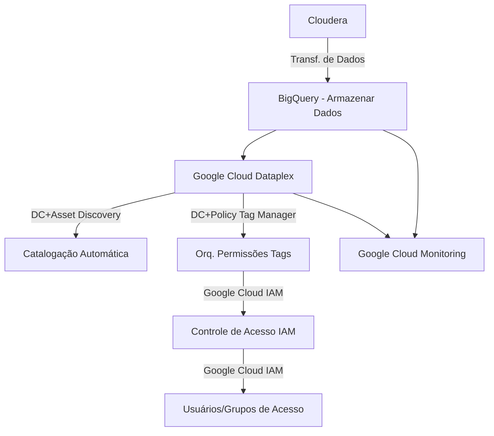
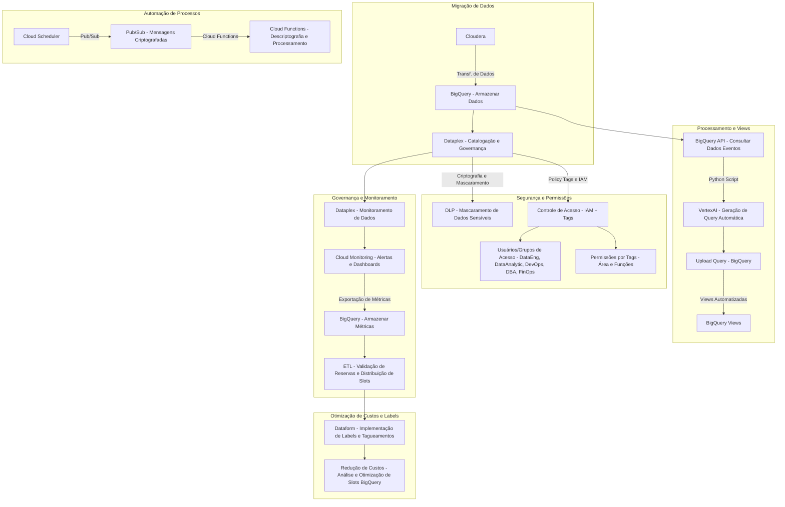

# Relatório de Estudos
**Nome do Estagiário:** Gabriel Alvim  
**Data:** 02/10/2024
#
# Gestão no Google Cloud Platform
A governança de dados no Google Cloud Platform (GCP) é essencial para a organização eficaz das informações, sendo estruturada em torno de pastas e projetos. A arquitetura do GCP permite que as organizações definam hierarquias claras, onde as pastas funcionam como contêineres para projetos, facilitando a gestão e a aplicação de políticas de governança. Essa estrutura promove um controle centralizado sobre acesso e permissões, assegurando que as práticas de segurança e conformidade sejam seguidas. Assim, a relação entre governança de dados e a arquitetura do GCP não apenas otimiza o gerenciamento de recursos, mas também fortalece a integridade e a proteção dos dados dentro da organização.

**Arquitetura GCP (Google Cloud Platform)**

## Importância Organizacional
1. **Controle Centralizado**: Facilita a gestão de acessos, segurança e monitoramento de custos em todos os projetos e squads.

2. **Segurança e Conformidade**: Implementação mais simples de políticas de segurança e compliance em toda a organização.
3. **Governança de Dados**: Ferramentas como Dataplex funcionam de forma mais eficiente e permitem a governança de dados de maneira centralizada.
4. **Faturamento Consolidado**: A gestão de custos é mais clara e permite uma melhor alocação de orçamento entre squads e equipes.
5. **Escalabilidade**: Facilita o crescimento e a adição de novos projetos, mantendo a governança e segurança consistentes.
6. **Automação Simplificada**: A integração de serviços e a automação de processos são mais seguras e fáceis de configurar em um ambiente organizacional.

**Hierarquia GCP (Google Cloud Platform)**

## Organização GCP (Google Cloud Platform)

## Pastas GCP (Google Cloud Platform)

## Projeto GCP (Google Cloud Platform)

## Papéis GCP (Google Cloud Platform)

#
# Fluxograma de migração (sem processamento de dados) v.01

#
# Fluxograma de migração (sem processamento de dados) v.02

#
# Descrição do Fluxograma de Migração de Dados com BigQuery e Dataplex
1. **Migração de Dados**: Reflete o processo inicial de migração dos dados do Cloudera para o BigQuery, seguido da catalogação e governança dos dados no Dataplex.

2. **Segurança e Permissões**: Detalha as regras de permissionamento, criptografia e mascaramento de dados sensíveis com o uso do DLP e controle de acesso com tags de áreas funcionais como DataEng, DataAnalytic, DevOps, DBA, e FinOps.

3. **Automação de Processos**: Mostra como o Cloud Scheduler, Pub/Sub e Cloud Functions são integrados para automação e processamento seguro de dados criptografados.

4. **Processamento e Views**: Focado no uso das APIs do BigQuery e VertexAI para gerar queries automatizadas a partir de dados relevantes e como essas views são criadas no BigQuery.

5. **Governança e Monitoramento**: A integração com o Dataplex e o Cloud Monitoring para monitoramento de dados, geração de alertas e a exportação de métricas para análise contínua no BigQuery.

6. **Otimização de Custos e Labels**: Expõe o uso de Dataform para implementar labels e otimizar a distribuição de recursos (slots) no BigQuery, garantindo uma gestão eficiente de custos.
#
# Resumo das Ferramentas tabela
| Funcionalidade                                        | Ferramenta no Google Cloud Platform                |
|------------------------------------------------------|----------------------------------------------------|
| Armazenamento e Consulta de Dados                     | BigQuery                                           |
| Catalogação e Governança de Dados                     | Dataplex + Data Catalog                            |
| Mascaramento de Dados Sensíveis                       | Google Cloud DLP                                   |
| Criptografia e Descriptografia de Mensagens           | Pub/Sub + Cloud Functions                           |
| Orquestração de Permissões com Tags                   | Data Catalog (Tag Templates) + Policy Tag Manager  |
| Controle de Acesso IAM                                | Google Cloud IAM                                   |
| Usuários e Grupos de Acesso                           | Google Cloud IAM                                   |
| Automação de Processos                                | Cloud Scheduler + Pub/Sub + Cloud Functions        |
| Criação de Views Automatizadas                        | BigQuery API + Vertex AI                           |
| Monitoramento de Dados e Alertas                      | Google Cloud Monitoring + Dataplex                 |
| Exportação de Métricas                                | Cloud Monitoring + BigQuery                         |
| Governança e Monitoramento de ETL e Processamento     | Dataplex                                           |
| Implementação de Labels e Tagueamentos                | Dataform                                           |
| Redução de Custos e Otimização de Slots               | Dataform + BigQuery                                |
#
## Dúvidas & Dificuldades:
Dúvidas em relação a utilização das ferramentas e aplicações direcionadas ao projeto FinOps. 

Dificuldade ao acessar materiais pouco didáticos e técnicos. Principalmente atualizados. 