# Eventarc
O **Eventarc** permite criar *arquiteturas orientadas* por *eventos* sem ter que implementar, personalizar ou manter a infraestrutura subjacente. Ele oferece uma solução padronizada para gerenciar o fluxo de alterações de estado, chamadas de eventos, entre *microsserviços* separados. Quando acionado, o **Eventarc** encaminha esses eventos para vários destinos e gerencia a entrega, segurança, autorização, observabilidade e erros de processamento para você.

**Funcionamento Eventarc**

Em suma, por exemplo: Uma empresa de varejo que usa diferentes serviços em nuvem, como *BigQuery* para análise de dados, *Dataplex* para gerenciamento de dados e *Data Loss Prevention* (DLP) para segurança. O *Eventarc* pode ser comparado a um sistema de orquestração de operações dentro dessa empresa.

Quando um cliente faz uma compra, isso gera um evento. O *Eventarc* é como um gerente de operações que pega essa notificação de compra e garante que ela seja enviada para os serviços adequados:

1. **BigQuery**: O gerente informa o time de análise para que os dados da compra sejam registrados e analisados em tempo real, ajudando a entender padrões de consumo.

2. **Dataplex**: Ele também avisa o serviço de gerenciamento de dados para que os dados sejam organizados e categorizados, facilitando o acesso e a integridade.

3. **DLP**: O gerente assegura que todos os dados sensíveis, como informações do cliente, sejam tratados de acordo com as políticas de segurança, garantindo que a privacidade esteja protegida.

Assim, o **Eventarc** mantém tudo em sincronia e funcionando perfeitamente, cuidando da entrega, segurança e monitoramento dos eventos, enquanto os times se concentram em suas funções específicas e na melhoria da experiência do cliente. Isso permite que a empresa opere de forma ágil e eficiente, sem se preocupar com os detalhes da infraestrutura de comunicação entre seus serviços.
#
# Arquiteturas orientadas a eventos
Uma arquitetura orientada a eventos é um padrão de design de software em que os microsserviços reagem a alterações no estado, chamados de eventos. Os eventos podem conter um estado (como o preço de um item ou um endereço de entrega) ou eventos podem ser identificadores (uma notificação de que um pedido foi recebido ou enviado, por exemplo). Os eventos acionam microsserviços que funcionam juntos para atingir uma meta comum, mas não precisam saber nada sobre cada um, exceto o formato do evento. Embora funcionem juntos, cada microsserviço pode aplicar uma lógica de negócios diferente e emitir seus próprios eventos de saída.

Um evento tem as seguintes características:

 - É um registro de algo que aconteceu.

 - Ele captura um fato imutável que não pode ser alterado ou excluído.

 - Isso ocorre independentemente de o serviço aplicar ou não qualquer lógica ao consumi-lo.

 - Ele pode ser mantido indefinidamente, em grande escala e consumido quantas vezes forem necessárias.

Em um sistema orientado a eventos, os eventos são gerados porprodutores de eventos , ingerido e filtrado por umroteador de eventos (ou agente) e fazer uma distribuição para osconsumidores de eventos (ou coletores) Os eventos são encaminhados para os assinantes definidos por um ou mais acionadores correspondentes. Esses três componentes (produtores de eventos, roteador de eventos, consumidores de eventos) são separados e podem ser implantados, atualizados e escalonados de maneira independente:

#
# Fluxograma de migração (sem processamento de dados)

```mermaid
flowchart TD
    subgraph Migração de Dados
        A[Cloudera] -->|Transf. de Dados| B[BigQuery - Armazenar Dados]
        B --> C[Dataplex - Catalogação e Governança]
    end

    subgraph Segurança e Permissões
        C -->|Criptografia e Mascaramento| D[DLP - Mascaramento de Dados Sensíveis]
        C -->|Policy Tags e IAM| E[Controle de Acesso - IAM + Tags]
        E --> F[Usuários/Grupos de Acesso - DataEng, DataAnalytic, DevOps, DBA, FinOps]
        E --> G[Permissões por Tags - Área e Funções]
    end

    subgraph Automação de Processos
        H[Cloud Scheduler] -->|Pub/Sub| I[Pub/Sub - Mensagens Criptografadas]
        I -->|Cloud Functions| J[Cloud Functions - Descriptografia e Processamento]
        J --> T[Eventarc - Captura de Eventos de BigQuery]
        T -->|Ação: Detecta Dados Sensíveis| DLPEvent[DLP API - Verificação e Mascaramento de Dados]
        DLPEvent -->|Mascaramento/Criptografia| D
    end

    subgraph Processamento e Views
        B --> K[BigQuery API - Consultar Dados Eventos]
        K -->|Python Script| L[VertexAI - Geração de Query Automática]
        L --> M[Upload Query - BigQuery]
        M -->|Views Automatizadas| N[BigQuery Views]
    end

    subgraph Governança e Monitoramento
        C --> O[Dataplex - Monitoramento de Dados]
        O --> P[Cloud Monitoring - Alertas e Dashboards]
        P -->|Exportação de Métricas| Q[BigQuery - Armazenar Métricas]
        Q --> R[ETL - Validação de Reservas e Distribuição de Slots]
    end

    subgraph Otimização de Custos e Labels
        R --> S[Dataform - Implementação de Labels e Tagueamentos]
        S --> T[Redução de Custos - Análise e Otimização de Slots BigQuery]
    end

```

#
# Processo de Descoberta e Mascaramento de Dados Sensíveis

## Descrição Fluxograma s/ Dataplex
**Inserção de dados no BigQuery**: O processo inicia com a inserção de novos dados no **BigQuery**.

**Eventarc detecta a inserção**: O **Eventarc** captura o evento da inserção de novos dados.

**Acionamento de Cloud Function**: A **Cloud Function** é acionada para processar os dados.

**Verificação de dados pela DLP API**: A **Cloud Function** invoca a **DLP API** para identificar dados sensíveis, como números de cartão de crédito ou CPFs.

**Mascaramento ou criptografia**: A **DLP API** aplica mascaramento ou criptografia aos dados sensíveis identificados.

**Armazenamento seguro no BigQuery**: Os dados já mascarados ou criptografados são armazenados de forma segura no **BigQuery**.
#
# Descoberta de Dados Sensíveis com Dataplex e DLP

## Descrição fluxograma c/ Dataplex
**Inserção de dados no BigQuery**: Dados são inseridos no **BigQuery**.

**Catalogação pelo Dataplex**: O **Dataplex** categoriza e classifica os dados, aplicando tags de confidencialidade.

**Eventarc detecta dados sensíveis**: O **Eventarc** detecta a inserção de novos dados sensíveis e dispara uma ação.

**Acionamento de Cloud Function**: Uma **Cloud Function** é acionada para processar a verificação de dados sensíveis.

**Verificação de dados pela DLP API**: A **Cloud Function** invoca a **DLP API** para identificar números de CPF e cartões de crédito.

**Mascaramento ou criptografia**: A **DLP API** aplica as ações necessárias de mascaramento ou criptografia.

**Monitoramento contínuo pelo Dataplex**: O **Dataplex** continua monitorando os dados e garantindo a governança das políticas aplicadas.
#
A principal diferença entre os dois fluxos é o papel do Dataplex no fluxograma 2, que adiciona uma camada de governança e monitoramento contínuo, além de catalogar dados antes de aplicar a descoberta detalhada pela DLP API.