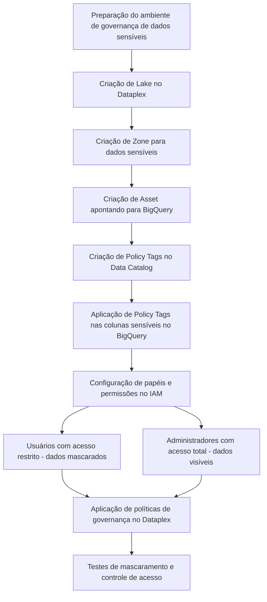

**Gabriel Alvim - FinOps 404**
#
# Mascaramento de Dados
Neste processo, foi realizada a preparação de um ambiente de governança de dados sensíveis no Google Cloud utilizando o **Dataplex**, o **Data Catalog**, e a configuração de permissões com o **IAM**. Inicialmente, foi criado um **Lake** no Dataplex, seguido da criação de uma **Zone** para *dados sensíveis* e de um **Asset** apontando para um dataset no **BigQuery**. Posteriormente, foram criadas **Policy Tags** no Data Catalog para categorizar os dados sensíveis, como *CPF* e *cartão de crédito*, e essas tags foram aplicadas diretamente nas colunas correspondentes no BigQuery. O processo também incluiu a configuração de papéis no IAM para controlar o acesso aos dados, diferenciando entre usuários com acesso *restrito* (que veem os dados mascarados) e *administradores* (com acesso total). Por fim, foram aplicadas políticas de governança no Dataplex para definir regras de mascaramento e foram realizados testes para verificar o funcionamento correto do controle de acesso aos dados sensíveis.
#
# Visualização do resultado
**Preview tabela acesso restrito**

Na imagem a cima verificamos que o usuário não tem acesso as colunas que contém dados sensíveis, não sendo possivél visualizar as colunas em questão.

**Schema da tabela acesso restrito**
.jpeg)
Ficando aparente de acordo com essa imagem.

**Preview tabela acesso total**

Na imagem a cima verificamos que o usuário tem acesso as colunas que contém dados sensíveis, sendo possivél visualizar as colunas em questão e os dados.

**Schema da tabela acesso total**

Ficando aparente de acordo com essa imagem.

#
## Fluxograma do processo

#
O "mascaramento" efetuado, foi mais relacionado ao controle de permissão de acesso via IAM, que determina quem pode ver quais dados sensíveis, com base nas permissões de cada usuário ou grupo. O qual os dados sensíveis não estão sendo alterados (como substituição de caracteres) e, em vez disso, estão sendo ocultos ou restringidos por meio de permissões de visualização. 

Não há um processo de mascaramento de dados propriamente dito. O "mascaramento" utilizado foi baseado em controle de acesso, não em substituição ativa dos dados sensíveis, ou seja, *ocultamento* dos dados. 

Para realizar um mascaramento real (como a substituição de caracteres), é preciso configurar explicitamente essa lógica no BigQuery ou usar serviços como o DLP (Data Loss Prevention) para realizar alterações no conteúdo dos dados.
#
## Possível automatização do processo
- **Templates de Governança**: criar templates pré-definidos de políticas de governança para aplicar a novos Assets automaticamente, reduzindo a necessidade de configuração manual.

- **Automação de Criação de Zonas e Assets**: Ao invés de realizar todas as etapas manualmente, usar scripts Terraform ou Deployment Manager do Google Cloud para criar lagos, zonas e assets de forma programática, acelerando o provisionamento do ambiente.

- **Integração com DLP para Mascaramento Real**: Dataplex pode se integrar com a API de DLP (Data Loss Prevention) para aplicar mascaramento real nos dados sensíveis, permitindo que os dados sejam dinamicamente alterados (ex: substituição de números de CPF) ao serem exibidos para usuários com permissões restritas.

## Caso de inserção de novos dados
- **Uso de Triggers e Cloud Functions**: Configurar Cloud Functions que monitoram alterações ou inserções em tabelas sensíveis (por meio de triggers ou eventos) e aplicam as Policy Tags automaticamente a novas colunas sensíveis que forem adicionadas.

- **Data Loss Prevention (DLP) API**: Configurar o DLP para inspecionar novos dados sensíveis que forem inseridos e aplicar mascaramento ou ajustes de governança automaticamente.
#
Esses processos podem ser complementados com a criação de pipelines automatizados no Cloud Composer (Apache Airflow), para gerenciar fluxos de trabalho de governança e aplicação de políticas.