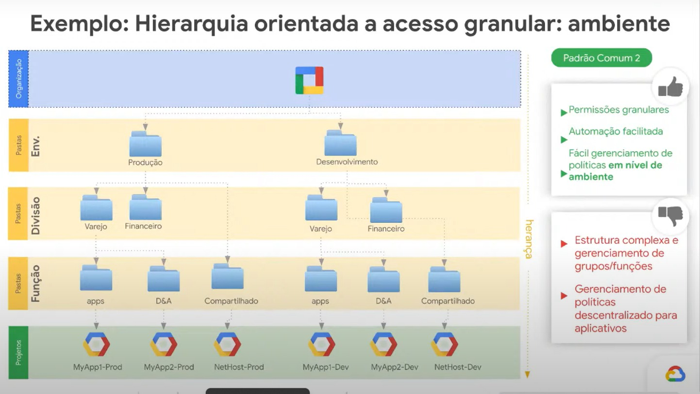

# 🏢 Gestão no Google Cloud Plataform

**Arquitetura GCP (Google Cloud Platform)**

**Hierarquia GCP (Google Cloud Platform)**

## Importância da Organização no GCP
1. **Controle Centralizado**: Facilita a gestão de acessos, segurança e monitoramento de custos em todos os projetos e squads.

2. **Segurança e Conformidade**: Implementação mais simples de políticas de segurança e compliance em toda a organização.
3. **Governança de Dados**: Ferramentas como Dataplex funcionam de forma mais eficiente e permitem a governança de dados de maneira centralizada.
4. **Faturamento Consolidado**: A gestão de custos é mais clara e permite uma melhor alocação de orçamento entre squads e equipes.
5. **Escalabilidade**: Facilita o crescimento e a adição de novos projetos, mantendo a governança e segurança consistentes.
6. **Automação Simplificada**: A integração de serviços e a automação de processos são mais seguras e fáceis de configurar em um ambiente organizacional.

## Google Admin Console

Possui funcionalidades de monitoramento e relatórios ajudam na tomada de decisões baseadas em dados, e a segurança é aprimorada com a implementação eficaz de políticas. Assim, a Google Admin Console torna o gerenciamento do GCP mais eficiente e seguro.

## Grupos

**Gerenciamento de grupos via Admin**

**Gerenciamento de grupos via GCP**

**Grupo no GCP**

## PAM

**Gerenciador de permissões temporárias**

## Migração de projetos

**Gerenciador de recursos**

