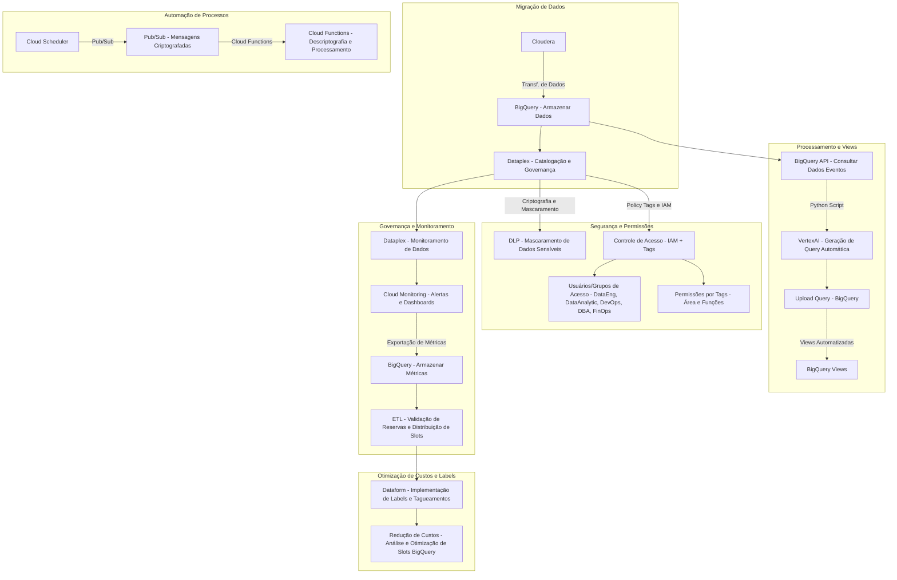
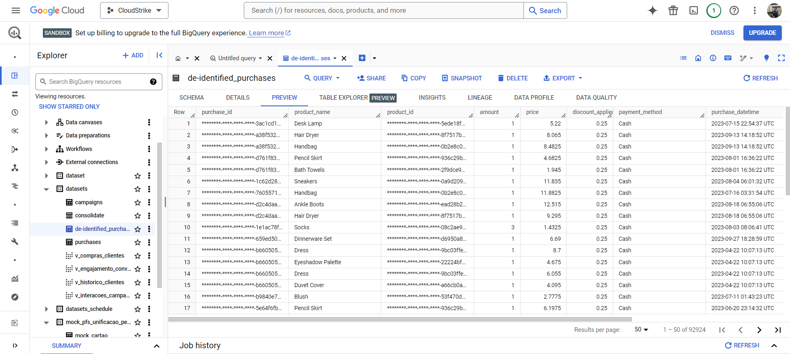
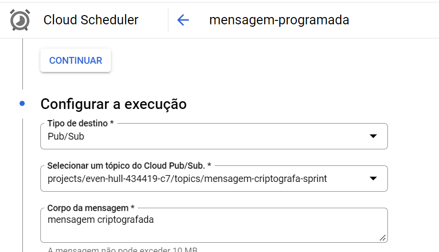
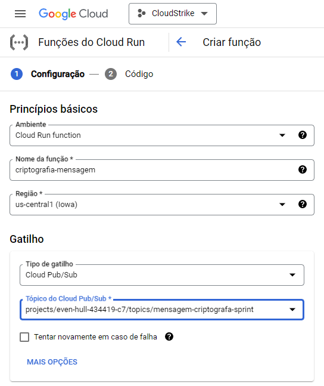
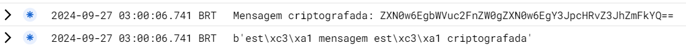
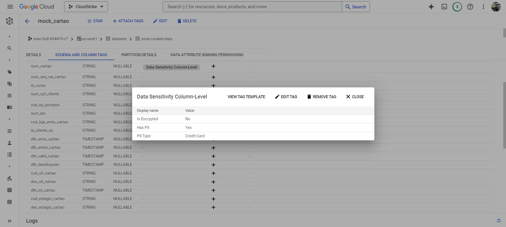

# Relatório SP01-3009 / Cloud Strike  

## 🎯 Objetivo
Foram realizadas atividades referente a criação de regras de permissionamento por **grupos** e **tags**, mascaramento de *dados sensíveis* do **BigQuery** com o **DLP (Data Loss Protection)** e a utilização de uma **organização** no ambiente **GCP**.
<br/>
<br/>

## 🌐 Tecnologias
* **Python 3**

* **Google Cloud Plataform**

* **Google Console Admin**

* **APIs do GCP e BigQuery**

* **APIs do Pub/Sub e Cloud Functions**
<br/>
<br/>

## Fluxograma de migração (sem processamento de dados) v.02



## 🛡️ Mascaramento de dados no BigQuery
O mascaramento de dados no BigQuery pode ser realizados de diversas formas, porém a forma que parece ser mais efetiva e de menor custo é utilizando o DLP (Data Loss Prevention). 
Durante a sprint testamos diversas formas de realizar essa atividade, sendo elas:

* **Utilização do Sensitive Data Protection com o Console -** O qual só foi possível realizar o mascaramento dos dados **RAW** como um **CSV**, e daí então criar uma tabela no BigQuery. O que não faz muito sentido visando a necessidade do projeto.



* **Utilização do Cloud Functions para mascaramento -** Após diversas tentativas, foi realizado o mascaramento, porém a function roda um script que faz um `UPDATE` via SQL para atualizar os dados da coluna sensível, o que seria trabalhoso e custoso para realizar em todas as tabelas.

* **Utilização do Cloud Run com Scheduler -** Realizado o mascaramento, porém a function roda um script que faz um `UPDATE` via SQL agendado via **Scheduler** para atualizar os dados da coluna sensível, o que seria trabalhoso e custoso para realizar em todas as tabelas.


<br/>
<br/>

## 🔐 Criptografia de mensagens do Pub/Sub

### > Fluxo
1. **Cloud Scheduler**: Agendador envia mensagem.
2. **Pub/Sub**: Tópico recebe e distribui.
3. **Cloud Functions**: Processa a mensagem.

### > Mensagens: Criptografia Personalizada
- **Definição**: Criptografia aplicada às mensagens antes do envio.
- **Exemplo**: Uso de AES (Advanced Encryption Standard) para garantir acesso apenas a destinatários autorizados.

### > Criação do temporizador



### > Criação da função / Código (Python)



### > 👨‍💻 Código utilizado

```python
import base64
import functions_framework


@functions_framework.cloud_event
def funcao_criptografia(cloud_event):
    # Parte do código que criptografa
    encrypted_message = cloud_event.data["message"]["data"]
    print(f"Mensagem criptografada: {encrypted_message}")

    # Parte do código que descriptografa
    decoded_message = base64.b64decode(encrypted_message)
    print(decoded_message)
```

### Visualização da POC (LOG)


<br/>
<br/>

## 📌 Gerenciamento de permissões via Tags 

Ao ter a catalogação dos dados no dataplex com as tags necessárias, é possível realizar o permissionamento atrevés delas, determinando quem pode ou não visualizar os dados marcados por aquelas tags. 



* Necessário **conta Organizacional**.


## 🏢 [Organização GCP](../relatorios/Organização_GCP.md)

