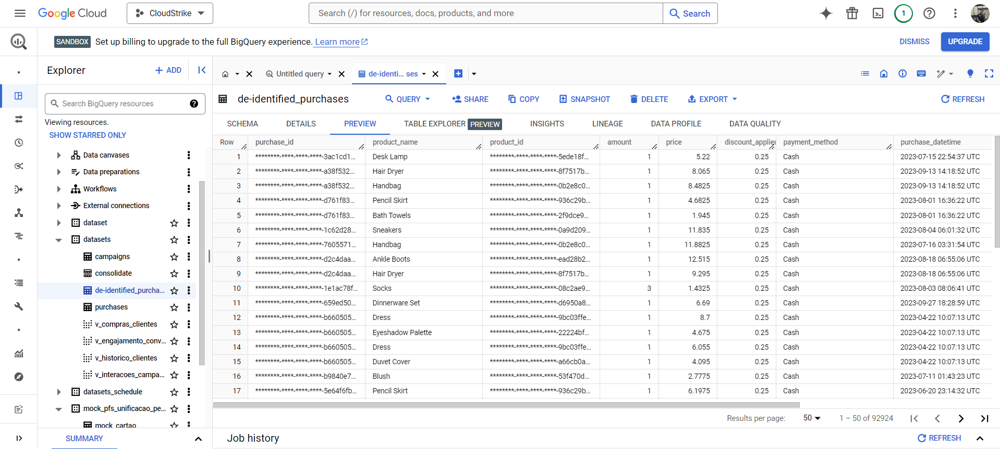
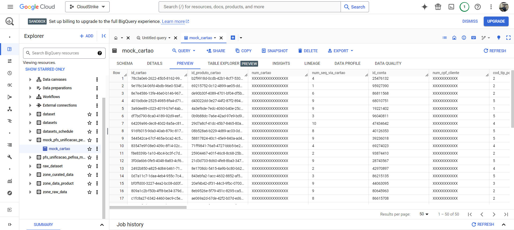
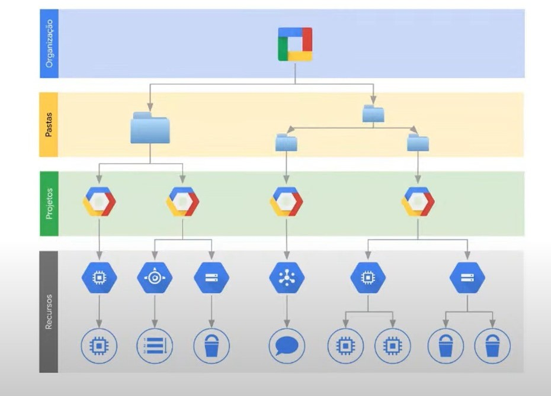
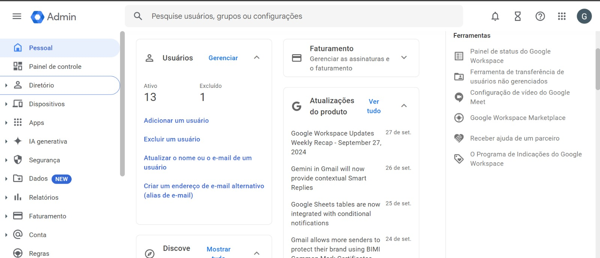
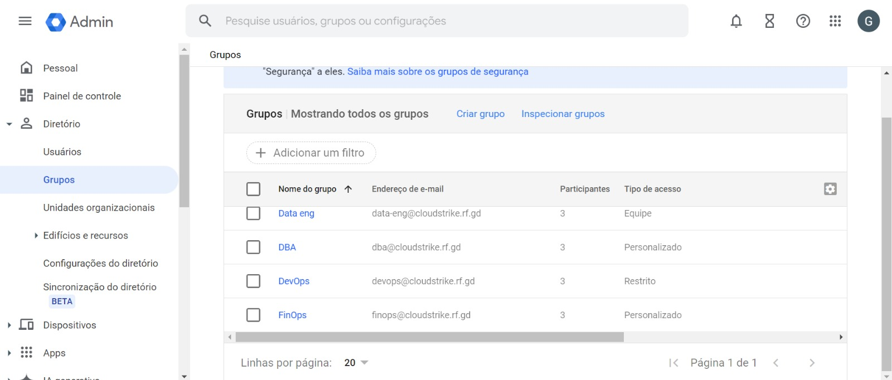
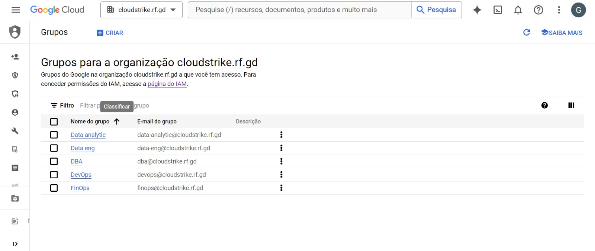
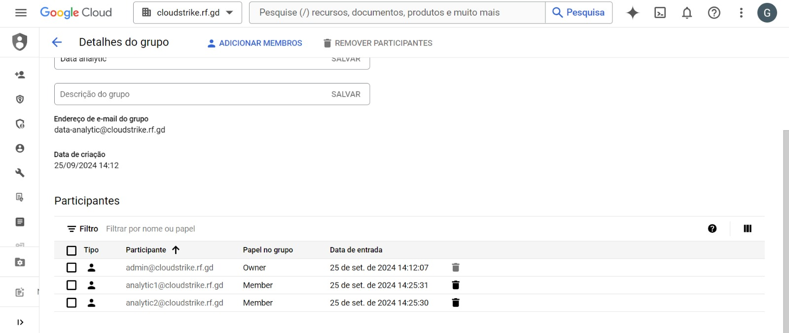
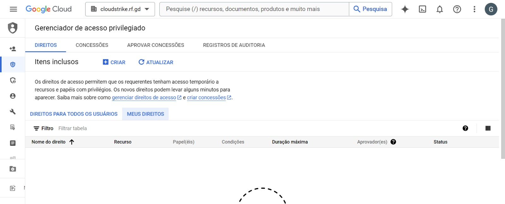
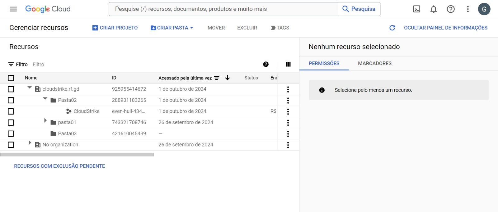

# Relatório SP01-3009 / Cloud Strike

## Objetivo
Foram realizadas atividades referente a criação de regras de permissionamento por **grupos** e **tags**, mascaramento de *dados sensíveis* do **BigQuery** com o **DLP (Data Loss Protection)** e a utilização de uma **organização** no ambiente **GCP**.

## Tecnologias
* **Python 3**

* **Google Cloud Plataform**

* **Google Console Admin**

* **APIs do GCP e BigQuery**

* **APIs do Pub/Sub e Cloud Functions**

## Mascaramento de dados no BigQuery
O mascaramento de dados no BigQuery pode ser realizados de diversas formas, porém a forma que parece ser mais efetiva e de menor custo é utilizando o DLP (Data Loss Prevention). 
Durante a sprint testamos diversas formas de realizar essa atividade, sendo elas:

* **Utilização do Sensitive Data Protection com o Console -** O qual só foi possível realizar o mascaramento dos dados **RAW** como um **CSV**, e daí então criar uma tabela no BigQuery. O que não faz muito sentido visando a necessidade do projeto.

* **Utilização do Cloud Functions para mascaramento -** Após diversas tentativas, foi realizado o mascaramento, porém a function roda um script que faz um `UPDATE` via SQL para atualizar os dados da coluna sensível, o que seria trabalhoso e custoso para realizar em todas as tabelas.

* **Utilização do Cloud Run com Scheduler -** Realizado o mascaramento, porém a function roda um script que faz um `UPDATE` via SQL agendado via **Scheduler** para atualizar os dados da coluna sensível, o que seria trabalhoso e custoso para realizar em todas as tabelas.

* **Utilização do DLP para mascaramento no BigQuery via python -** Está andamento a criação de um script `python` para mascarar os dados de tabelas do BigQuery utilizando o DLP. Atualmente existe apenas a necessidade de autenticar o permissionamento e autenticação de usuário para ser possível realizar os primeiros testes.

##  Organização no GCP

### > Dificuldades no gerenciamento de projetos sem Organização

* Gerenciamento de projetos e custos sem unificação

* Prejudica a consistência de políticas

* Complica auditorias e compliance

* Necessidade de repetir tarefas entre projetos

### > Benefícios do uso da Organização

* Organização e estruturação através de pastas e projetos

* Maior segurança dos dados

* Hierarquia clara, com pastas e projetos

* Políticas de segurança centralizadas

* Capacidade de compartilhar recursos entre projetos

* Melhor visualização de recursos e custos

* Facilidade no gerenciamento de grupo ou pessoas

### > Google Admin Console

Possui funcionalidades de monitoramento e relatórios ajudam na tomada de decisões baseadas em dados, e a segurança é aprimorada com a implementação eficaz de políticas. Assim, a Google Admin Console torna o gerenciamento do GCP mais eficiente e seguro.

### > Grupos

*Gerenciamento de grupos via Admin*

*Gerenciamento de grupos via GCP*

*Grupo no GCP*

### > PAM

*Gerenciador de permissões temporárias*

### > Migração de projetos

*Gerenciador de recursos*

